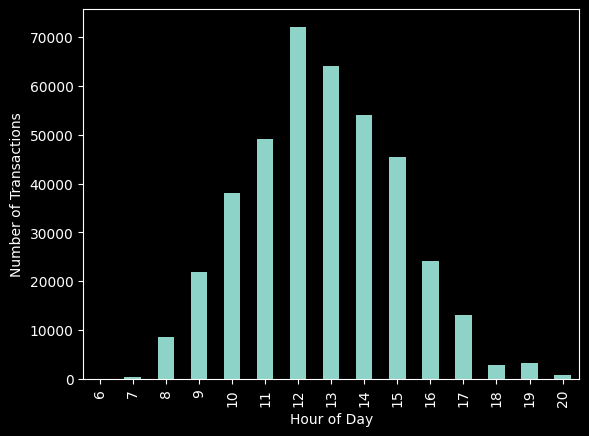
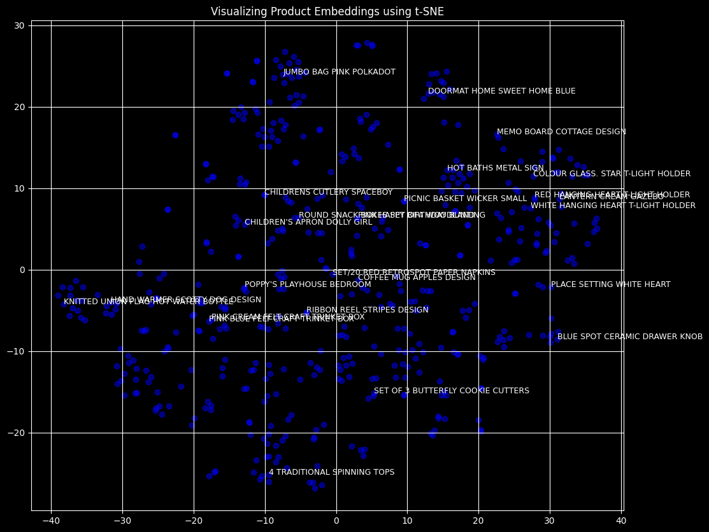
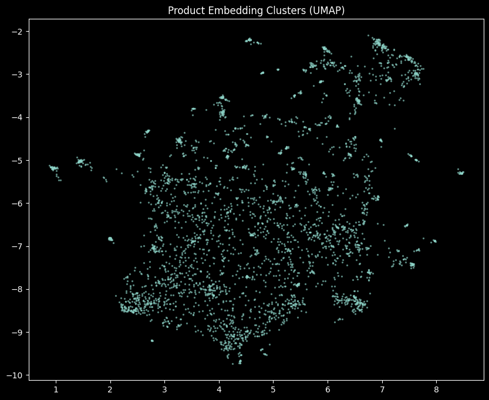

[](https://colab.research.google.com/github/Yavar-NK/Product-Recommender-ML/blob/main/notebooks/Product_Recommendations_using_word2vec.ipynb)

# End-to-End Production-Ready Product Recommender System

A modular, production-grade Machine Learning pipeline that leverages NLP embeddings to build an intelligent recommendation engine. This project transitions the initial model into an enterprise-level MLOps architecture, featuring structural code separation, robust experiment tracking, and complete containerization capabilities.

## 🚀 Key Features & Architecture
* **Modular Codebase:** Clean separation of concerns with dedicated modules for data loading, preprocessing, model training, and API deployment under the `src/` directory.
* **Production-Grade API:** Powered by **FastAPI** and served via **Uvicorn** for high-performance, asynchronous, and scalable model serving.
* **Experiment Tracking & MLOps:** Integrated with **MLflow** to seamlessly log hyperparameters, pipeline metrics, and model artifacts (`mlruns/`).
* **Containerization:** Out-of-the-box **Dockerfile** configured with optimized multi-layer caching (`python:3.10-slim`) to guarantee cross-environment reproducibility.

---

## 📂 Project Structure
```text
├── src/
│   ├── data_loader.py    # Robust data ingestion (automated Kaggle API downloads)
│   ├── preprocess.py    # Feature engineering and text embedding pipelines
│   ├── train.py         # Model training, validation, and MLflow logging
│   └── app.py           # Production FastAPI web service
├── models/              # Pre-trained models and saved weights
├── mlruns/              # MLflow localized tracking repository
├── Dockerfile           # Optimized production Docker deployment script
├── .gitignore           # Git exclusions for models and cache layers
└── requirements.txt     # Locked project dependencies
```
## 📊 Research, Insights & Visualizations

We conducted a deep dive into the transaction data using a dedicated research notebook to understand customer behavior and evaluate the semantic quality of our recommendation system.

### 🚀 Interactive Notebook
You can access and run the complete exploratory analysis and visualization pipeline directly in Google Colab:

[](https://colab.research.google.com/github/Yavar-NK/Product-Recommender-ML/blob/main/notebooks/Product_Recommendations_using_word2vec.ipynb)

---

---

### ⏰ 1️⃣ Hourly Transaction Analysis
We analyzed the distribution of purchases throughout the day during the Exploratory Data Analysis (EDA) phase. Peak shopping hours occur between 12:00 PM and 2:00 PM, which helps in identifying key windows for user engagement.


*Figure 1: Distribution of the number of transactions based on the hour of the day.*

---

### 🗺️ 2️⃣ Product Embedding Space Visualization (t-SNE)
To evaluate the quality of the learned representations, we extracted the high-dimensional product vectors from the trained Word2Vec model and applied t-SNE to project them into a 2D space. Products that are frequently purchased together in the same shopping sessions naturally form distinct, meaningful clusters.


*Figure 2: t-SNE projection of the trained product embeddings, showcasing learned semantic similarities.*

---

### 🧬 3️⃣ Advanced Dimensionality Reduction via UMAP
In addition to t-SNE, we employed UMAP (Uniform Manifold Approximation and Projection) to better preserve both local and global structures of our product embeddings. UMAP successfully segregates the item space into dense topological clusters, confirming that the representation learning pipeline is highly stable across the entire catalog.


*Figure 3: UMAP visualization of the product embeddings, demonstrating clear global grouping and semantic structure.*


## How to Run 🛠️

### 1. Local Serving (FastAPI)
To launch the API server locally without containerization, run the following command from the root directory:

```bash
uvicorn src.app:app --reload --host 0.0.0.0 --port 8000

```
### 2. Production Deployment (Docker)
The codebase includes a fully-optimized Docker environment. To build and run the containerized application:

```bash
docker build -t product-recommender:v1 .
docker run -p 8000:8000 product-recommender:v1
